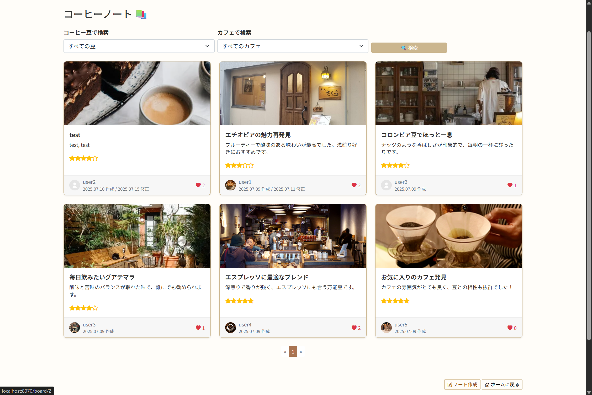
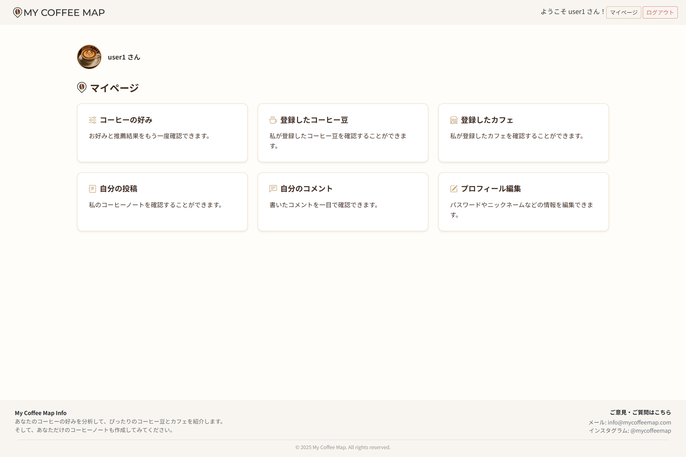

# ☕ My Coffee Map

> **사용자의 커피 취향에 따라 원두와 카페를 추천하고, 커피 노트를 기록·공유하는 웹 서비스(플랫폼)**  
> 웹 기반으로 개발되었으며, 추후 모바일 서비스로 확장 가능한 구조로 설계되었습니다.

---

## 📌 프로젝트 개요

- **프로젝트명:** My Coffee Map  
- **진행 기간:** 2025.06.30 ~ 2025.07.24 (4주)  

- **기획 배경:**  
  다양한 커피를 즐기는 사용자들이 자신의 취향을 발견하고, 경험을 기록하며  
  다른 사용자와 공유할 수 있는 공간을 제공하고자 기획했습니다.

- **핵심 기능:**  
  - 비회원도 커피 취향 선택 및 커피노트 열람 가능  
  - 일반로그인/소셜로그인, 로그아웃
  - 회원가입, 이메일 본인인증, 회원탈퇴
  - 비밀번호 재설정, 프로필 수정
  - 커피 취향 선택 → 원두 및 카페 추천  
  - 원두/카페 등록 및 조회  
  - 커피노트 작성 (별점, 좋아요 포함)  
  - 커피노트에 댓글 작성  
  - 마이페이지 (작성한 글, 등록한 정보 확인 등)

---

## 🌐 일본어 웹페이지로 개발한 이유

본 프로젝트는 **일본 사용자를 주요 대상으로 설정**하여 전체 UI와 기능을 **일본어 기반으로 설계 및 개발**했습니다.

- 🇯🇵 **타겟 사용자에 맞춘 언어 설계**  
  커피에 관심 있는 일본 현지 사용자들을 주요 이용자로 상정하여, **직관적이고 사용하기 쉬운 일본어 UI**를 구현했습니다.

- 🌍 **현지화(Localization) 실습**  
  일본어 환경에 맞춘 웹페이지 개발을 통해 **서비스의 현지화 및 설계 능력**을 기를 수 있었습니다.  
  
- 💼 **취업 준비의 일환**  
  한국뿐만 아니라 **일본 IT 기업 취업도 염두에 두고**, 실제 일본어 UI로 기능을 구현하는 과정을 통해  
  **현지 실무에 대한 적응력**을 높이고, 일본어 기반의 **포트폴리오로 활용할 수 있도록 설계**했습니다.

- 🖥 **일본어 특유의 UI/UX 대응 연습**  
  문장 길이, 표현 방식 등이 다른 일본어의 특성을 고려하여 **레이아웃과 화면 구성에 신경** 썼으며,  
  **보다 세련된 사용자 경험(UX)**을 제공하기 위해 번역어플을 이용했습니다.

---

## 🛠 개발 환경 및 기술 스택

### 📌 개발 툴 및 서버
- **IDE:** STS4 (Spring Tool Suite 4)
- **서버:** Apache Tomcat 9.0, AWS
- **운영 체제:** Windows 11, 10
- **로컬 접속 주소:** [http://localhost:8070/mycoffeemap](http://localhost:8070/mycoffeemap)
- **AWS 배포 주소:** [http://mycoffeemap.kro.kr:8070](http://mycoffeemap.kro.kr:8070)

### 💻 Backend
- Java 21  
- Spring Boot 3.3.12  
- Spring Data JPA  
- MySQL 8

### 🎨 Frontend
- Thymeleaf  
- JSP  
- HTML5 / CSS3  
- JavaScript / Bootstrap 5  
- AJAX (비동기 데이터 처리)

### 📂 관리
- Git / GitHub

---

## 👩‍💻 팀 구성 및 역할

본 프로젝트는 2인 팀으로 진행되었으며, 기획부터 개발, 배포까지 전 과정을 분담하여 협업하였습니다.

---

### 🔹 강혜미(Kang Hyemi)
- 사용자(User) 관련 기능 개발  
  - 일반로그인/소셜로그인, 로그아웃
  - 회원가입, 토큰 기반 이메일 본인인증, 회원탈퇴
  - 비밀번호 재설정, 사용자 프로필 수정
  - 프로필 이미지 업로드 등
- 데이터베이스 구조 설계
- 파일 업로드 로직 구현
- GitHub 및 AWS를 활용한 배포
- 프로젝트 발표용 PPT 제작
- 개발 문서 정리 및 관리

### 🔹 한현주(Han Hyunju)
- 프로젝트 전체 기획 및 UI 설계
- 데이터베이스 구조 설계
- 주요 기능 개발  
  - 원두(Bean), 카페(Cafe) 등록 및 추천  
  - 커피 노트(Board) 작성, 별점, 좋아요, 댓글 기능 구현
- Thymeleaf 템플릿 구성 및 프론트 스타일링
- 프로젝트 발표용 PPT 제작
- 개발 문서 정리 및 관리

---

## ✨ 주요 기능

### 👤 사용자
- 회원가입 및 회원탈퇴
- 일반로그인
- 소셜로그인(구글)
- 토큰 기반 이메일 본인인증
- 비밀번호 잊어버렸을 경우 재설정 이메일 전송

### 🔎 커피 취향 분석
- 로스팅 단계 + 향미 선택 → 선호 원두 유형 파악
- 결과에 따라 추천 원두 및 카페 목록 출력(DB 더미 이용)

### 🫘 원두 / 카페 등록
- 로그인한 사용자만 등록 가능
- 원두: 이름, 설명, 로스팅, 향미, 이미지(DB 더미 이용) 선택
- 카페: 이름, 주소, 사용 원두, 이미지(DB 더미 이용) 선택
- 추후 이미지 업로드 기능 추가 예정

### 📓 커피 노트
- 커피 경험을 자유롭게 기록 가능
- 커피나 카페 이미지 업로드 가능
- 별점 부여 + 관련 원두/카페 선택
- 댓글 및 좋아요 기능 포함

### 🗂️ 마이페이지
- 등록한 원두/카페/노트/댓글 확인
- 나의 커피 취향 결과 확인
- 사용자 정보 수정

---

## 📝 개발 소감

- **강혜미 (Kang Hyemi)**  
  이번 my coffee map 프로젝트에서는 보안, 배포 환경, 사용자 편의성을 최우선으로 고려하며 설계와 구현에 임했습니다.
  패스워드 DB저장시 암호화를 적용해 사용자 정보를 안전하게 보호했고,
  이메일 인증은 토큰 기반으로 처리해 보안과 사용자 편의성을 동시에 확보했습니다.
  이미지 저장 경로는 OS 환경에 따라 분기 처리해 배포 시 호환성 문제를 예방하도록 구현하였습니다.
  SecurityConfig를 활용한 보안 설정에도 많은 신경을 썼으며, 인증/인가 흐름을 명확하게 구분하고 예외 처리까지 세심하게 설계했습니다.
  
  이번 프로젝트는 단순한 학습을 넘어, 실무와 가까운 경험을 쌓으며
  **보안 강화, 운영 환경 고려, 사용자 중심 설계**의 중요성을 깊이 깨달은 값진 시간이었고,
  안정적이고 확장 가능한 서비스 개발 역량을 키울 수 있었습니다.

- **한현주 (Han Hyunju)**  
  세 번째 프로젝트인 **My Coffee Map**은 사용자 취향 기반 추천 서비스로,  
  기획부터 UI 설계, 기능 구현까지 전 과정을 두 명의 팀원이 밀접하게 협업하여 수행했습니다.  
  **Java, Spring Boot, JPA, Thymeleaf** 기반으로 백엔드와 프론트엔드를 모두 담당하며,  
  사용자 취향 분석 알고리즘, 원두 및 카페 등록/조회, 커피노트 작성, 댓글, 좋아요 등 **핵심 기능을 구현**했습니다.  
  
  짧은 기간에도 불구하고 **높은 집중도와 유기적인 협업**을 통해  
  실용성과 확장성을 갖춘 웹 서비스를 완성했으며,  
  **모바일 연동을 고려한 구조**로 개발하였습니다.  
  
  이 경험을 통해 **전반적인 개발 능력과 문제 해결력**,  
  그리고 **주도적인 설계 역량**을 함께 강화할 수 있었습니다.

---

## 📸 화면 (View)

### 🏠 메인화면

### 🎯 커피 취향 선택

### 📊 나의 취향 결과 확인

### 📒 커피 노트 리스트

### 🫘 원두 등록 화면

### ☕ 카페 등록 화면

### 📝 커피 노트 작성

### 👤 마이페이지

---

## 🔗 GitHub 링크

[https://github.com/hyeming-way/my-coffee-map](https://github.com/hyeming-way/my-coffee-map)

---

## ✅ 향후 개선사항 (To-Do)
- AI 추천 알고리즘 고도화  
- 반응형 UI 적용 (모바일 최적화)  
- 커피 지도 기반 위치 추천 기능 추가

---
