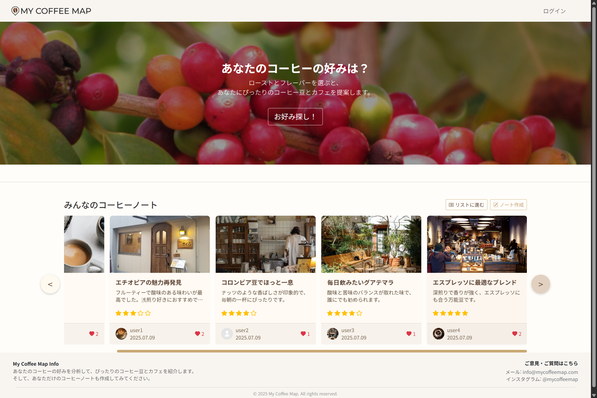
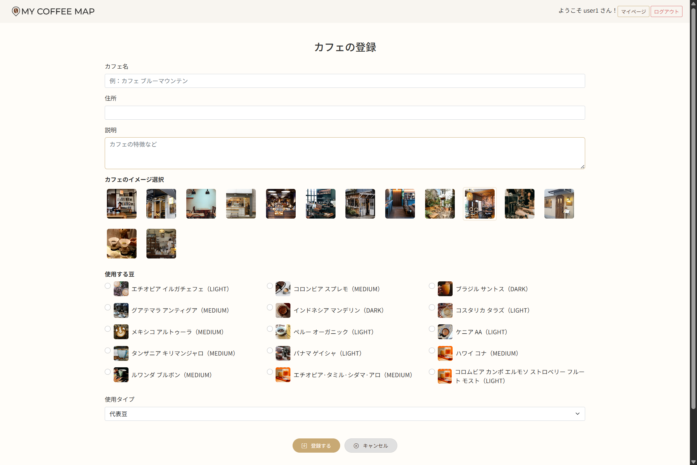

# ☕ My Coffee Map

> **ユーザーのコーヒーの好みに応じて、豆とカフェをおすすめし、コーヒーノートを記録・共有できるウェブサービス（プラットフォーム）です。**  
> Webベースで開発されており、今後モバイルサービスへの拡張も視野に入れた構造となっています。

---

## 📌 プロジェクト概要

- **プロジェクト名：** My Coffee Map  
- **開発期間：** 2025年6月30日〜7月24日（4週間）  

- **企画背景：**  
  コーヒーを楽しむ多くのユーザーが自分の好みを見つけ、経験を記録し、  
  他のユーザーと共有できる空間を提供することを目的に企画しました。

- **主な機能：**  
  - 非会員でもコーヒーの好み選択・ノート閲覧が可能  
  - ログイン、新規登録、メール認証  
  - コーヒーの好み選択 → 豆とカフェの推薦  
  - 豆・カフェの登録および閲覧  
  - コーヒーノート作成（評価、いいね付き）  
  - コーヒーノートにコメント投稿  
  - マイページ（投稿、登録情報の確認など）

---

## 🌐 日本語ページで開発した理由

本プロジェクトは**日本のユーザーを主なターゲット**として設定し、  
全体のUIと機能を**日本語ベースで設計・開発**しました。

- 🇯🇵 **ターゲットに合わせた言語設計**  
  コーヒーに関心のある日本のユーザーを想定し、  
  **直感的で使いやすい日本語UI**を構築しました。

- 🌍 **ローカライゼーションの実践**  
  日本語環境に適したWeb開発を通じて、  
  **多言語対応の設計スキル**を身につけることができました。

- 💼 **就職活動の一環**  
  日本IT企業への就職も視野に入れ、**日本語UIでの機能実装経験**を通じて、  
  **現地の業務への適応力**を高め、**ポートフォリオとして活用**できるよう設計しました。

- 🖥 **日本語特有のUI/UX対応の練習**  
  表現や文の長さに配慮した**レイアウトと画面設計**を工夫し、  
  **洗練されたUXの提供**を目指して開発しました。

---

## 🛠 開発環境と技術スタック

### 📌 開発ツール・サーバー
- **IDE：** STS4（Spring Tool Suite 4）  
- **サーバー：** Apache Tomcat 9.0, AWS  
- **OS：** Windows 11, 10  
- **ローカル接続URL：** [http://localhost:8070/mycoffeemap](http://localhost:8070/mycoffeemap)

### 💻 バックエンド
- Java 21  
- Spring Boot 3.3.12  
- Spring Data JPA  
- MySQL 8  

### 🎨 フロントエンド
- Thymeleaf  
- JSP  
- HTML5 / CSS3  
- JavaScript / Bootstrap 5  
- AJAX（非同期処理）

### 📂 バージョン管理
- Git / GitHub

---

## 👩‍💻 チーム構成と役割

本プロジェクトは2人チームで実施し、企画から開発、公開までの全てを協力して担当しました。

---

### 🔹 강혜미（Kang Hyemi）
- ユーザー関連機能の開発  
  - ログイン、新規登録、メール認証  
  - プロフィール画像アップロード など  
- DB構造の設計  
- ファイルアップロードのロジック実装  
- GitHubとAWSを用いたデプロイ作業  
- 発表用PPT作成  
- 開発文書の整理と管理

### 🔹 韓 炫朱, ハン・ヒョンジュ(Han Hyunju)
- プロジェクト全体の企画とUI設計  
- データベース構造の設計  
- 主な機能の開発  
  - コーヒー豆（Bean）・カフェ（Cafe）の登録と推薦  
  - コーヒーノート（Board）の投稿、評価、コメント・いいね機能  
- Thymeleafによるテンプレートとフロントのスタイリング  
- 発表用PPT作成  
- 開発文書の整理と管理

---

## ✨ 主な機能

### 👤 ユーザー
- 会員登録 / ログイン

### 🔎 コーヒー好み診断
- 焙煎度＋風味の選択 → 好みの豆タイプを分析  
- 結果に応じて、推薦豆・カフェを表示（DBダミー使用）

### 🫘 豆 / カフェ登録
- ログインユーザーのみ可能  
- 豆：名前、説明、焙煎、風味、画像（ダミーデータ）  
- カフェ：店名、住所、使用豆、画像（ダミーデータ）  
- ※今後、画像アップロード機能を追加予定

### 📓 コーヒーノート
- コーヒー体験を自由に記録可能  
- 画像添付・評価・豆/カフェ選択  
- コメント・いいね機能

### 🗂️ マイページ
- 投稿した豆・カフェ・ノート・コメントを確認  
- 自分の好み結果の再確認  
- ユーザー情報の編集

---

## 📝 開発を通じて

- **韓 炫朱, ハン・ヒョンジュ(Han Hyunju）**  
  3つ目のチームプロジェクトである**My Coffee Map**は、ユーザーの好みに基づいた推薦型サービスであり、  
  企画からUI設計、主要機能の開発まで、2人のチームで密に連携して進めました。  

  **Java, Spring Boot, JPA, Thymeleaf** を活用し、バックエンドとフロントエンドの両方を担当。  
  好み分析ロジック、豆・カフェの登録・表示、ノート投稿、いいね・コメントなど**中心的な機能**を実装しました。  

  短期間でありながら、**集中力と協力によって実用性と拡張性を兼ね備えた**Webサービスを完成させ、  
  将来モバイル対応も想定した設計となっています。  

  この経験を通して、**開発力・課題解決力・設計スキル**のすべてをバランス良く向上させることができました。

---

## 📸 画面ビュー（View）

### 🏠 メインページ

### 🎯 好み選択

### 📊 好み結果の確認

### 📒 ノート一覧

### 🫘 豆の登録

### ☕ カフェの登録

### 📝 ノートの作成

### 👤 マイページ

---

## 🔗 GitHub リンク

[https://github.com/hyeming-way/my-coffee-map](https://github.com/hyeming-way/my-coffee-map)

---

## ✅ 今後の改善予定（To-Do）
- OAuth2を使ったソーシャルログイン連携  
- AIによる推薦アルゴリズムの高度化  
- レスポンシブUI対応（モバイル最適化）  
- 地図ベースでのカフェ推薦機能の追加
